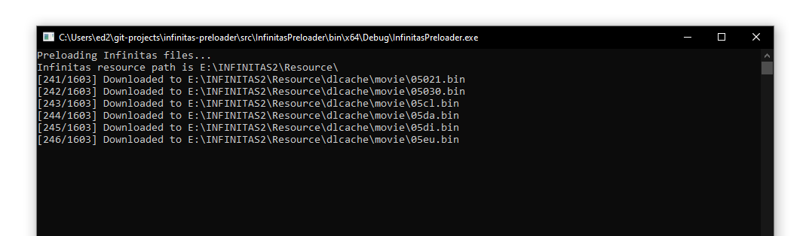

# IIDX Infinitas File Preloader

This app pre-downloads some music/movie/layer files direct from Konami to the IIDX Infinitas Resources directory.

### To use

1. Make sure Infinitas 2 is installed
2. Download the zip file from the releases page and unzip it somewhere
3. Run InfinitasPreloader.exe (making sure filelist.csv is next to it)
4. Wait quite a bit



### Notes and limitations

The file list is currently limited to the first release of Infinitas 2. This is because that is the only version that I have a decrypted ```downloadlist.xml``` from. If someone can get me a newer version of that file I can update the file list CSV file. Therefore there are currently quite a few missing recent songs, but these seem to be faster to download on the CDN anyway.

Some downloads might fail. Just run the app again and it will only download what it didn't manage to get the first time. Likewise it will also "fill in" the gaps in your download list (of songs it knows about).
